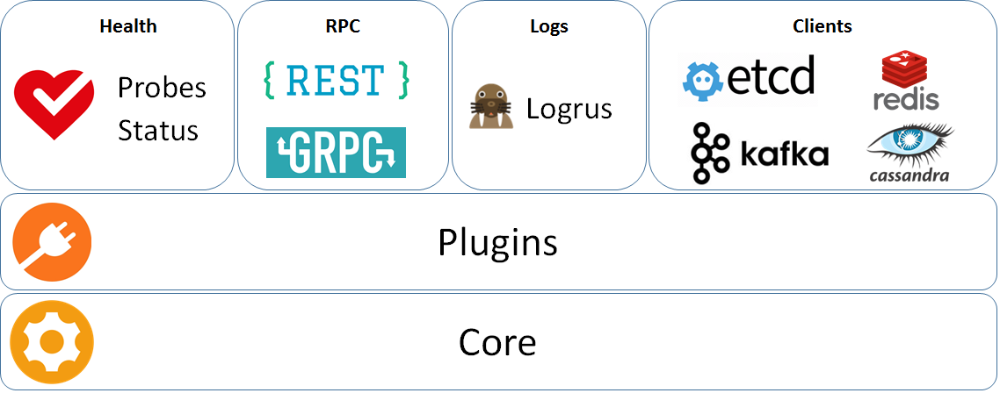

# CN Infra

The CN infra is a framework that can be used to build a customized management/control
plane for cloud-native Virtual Network Functions (VNFs). Cloud-native VNFs are also 
known as "CNFs".

GoDoc can be browsed [online](https://godoc.org/github.com/ligato/cn-infra).

The tool used for managing third-party dependencies is [Glide](https://github.com/Masterminds/glide). After adding or updating
a dependency in `glide.yaml` run `make install-dep` to download specified dependencies into the vendor folder. 

If you are interested in contributing, please see the [contribution guidelines](CONTRIBUTING.md).

# Architecture

RPC - Easily to expose go routines using REST & GRPC
DB - provides a common API and connectivity to the data store (etcd, Redis, Casssandra)
Messaging - provides a common API and connectivity to message busses (Kafka, ...)
Logs - Integrated Logru for logging plugin plus RPC to change log level at runtime.
Health - Self health check mechanism among plugins plus RPCs:
 - probes (callable remotely from K8s)
 - status (health check status) 
Core - lifecycle management of plugins (loading, initialization, unloading)