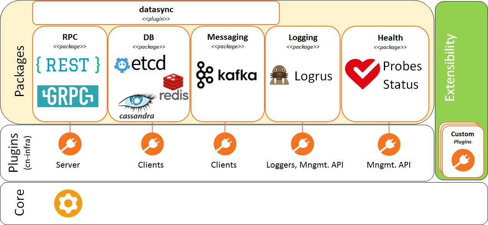

# CN-Infra

[](https://travis-ci.org/ligato/cn-infra)
[](https://coveralls.io/github/ligato/cn-infra?branch=master)
[](https://goreportcard.com/report/github.com/ligato/cn-infra)
[](https://godoc.org/github.com/ligato/cn-infra)
[](https://github.com/ligato/cn-infra/blob/master/LICENSE.md)

CN-Infra (cloud-native infrastructure) is a Golang platform for building
custom management/control plane applications for cloud-native Virtual 
Network Functions (VNFs). Cloud-native VNFs are also known as "CNFs". 

## Cloud-Native Virtual Network Functions (CNFs)
So what is a *cloud-native* virtual network function? 

A virtual network function (or VNF), as commonly known today, is a software
implementation of a network function that runs on one or more *virtual 
machines* (VMs) on top of the hardware networking infrastructure — routers,
switches, etc. Individual virtual network functions can be connected or
combined together as building blocks to offer a full-scale networking 
communication service. A VNF may be implemented as standalone entity using
existing networking and orchestration paradigms - for example being 
managed through CLI, SNMP or Netconf. Alternatively, an NFV may be a part
of an SDN architecture, where the control plane resides in an SDN 
controller and the data plane is implemented in the VNF.

A *cloud-native VNF* is a VNF designed for the emerging cloud environment -
it runs in a container rather than a VM, its lifecycle is orchestrated 
by a container orchestration system, such as Kubernetes, and it's using
cloud-native orchestration paradigms. In other words, its control/management
plance looks just like any other container based [12-factor app][1]. to 
orchestrator or external clients it exposes REST or gRPC APIs, data stored
in centralized KV data stores, communicate over message bus, cloud-friendly
logging and config, cloud friendly build & deployment process, etc. Yet,
it still provides a high-performance data plane.

Model-driven approach - CNF APIs modeled using protobufs.

## The CN-Infra Platform Architecture

Each management/control plane app built on top of the CN-Infra platform is 
basically a set of modules called "plugins" in CN-Infra lingo, where each 
plugin provides a very specific/focused functionality. Some plugins are 
provided by the CN-Infra platform itself, some are written by the app's 
implementors. In other words, the CN-Infra platform itself is implemented
as a set of plugins that together provide the platform's functionality, 
such as logging, health checks, messaging (e.g. Kafka), a common front-end
API and back-end connectivity to various KV data stores (Etcd, Cassandra, 
Redis, ...), and REST and gRPC APIs. App writers can pick and choose only
those platform plugins that are required by their app; for example, if an
app does not need a KV store, the CN-Infra platform KV data store plugins
would not be included in the app. 



The CN-Infra platform comprises a **[Core](core)** that provides plugin
lifecycle management (initialization and graceful shutdown of plugins) 
and a set of platform plugins. The platform can be easily extended with
plugins. 

An example of a VNF control/management plane built on top of the CN-Infra
platform is the [VPP Agent](https://github.com/ligato/vpp-agent).

## CN-Infra Plugins
### Currently Available Plugins
Platform plugins in the current CN-Infra release provide the following 
functionality:

* **RPC** - allows to expose application's API via REST or gRPC:
    * [HTTPmux](httpmux) -  HTTP requests and allows app plugins to define
      their own REST APIs.
        
* **Data Stores** - provides a common data store API for app plugins (the 
    Data Broker) and back-end clients for Etcd, Redis and Cassandra. The 
    data store related plugin are as follows:
  - [Etcd](db/keyval/etcdv3) - implements keyval skeleton provides access 
    to etcd
  - [Redis](db/keyval/redis) - implements keyval skeleton provides access
    to redis
  - [Casssandra](db/sql/cassandra) -
    
* **Messaging** - provides a common API and connectivity to message buses:
    - Kafka](messaging/kafka) - provides access to Kafka brokers
    
* **Logging**:
    * [Logrus wrapper](logging/logrus) - implements logging skeleton 
      using the Logrus library. An app writer can create multiple loggers -
      for example, each app plugin can have its own logger. Log level
      for each logger can be controlled individually at run time through
      the Log Manager REST API.
    * [Log Manager](logging/logmanager) - allows the operator to set log
      level for each logger using a REST API.
    
* **[Health](statuscheck)** - Self health check mechanism between plugins 
    plus RPCs:
    - [StatusCheck](statuscheck) - allows to monitor the status of plugins
      and exposes it via HTTP
    - Probes (callable remotely from K8s)
  
* **Miscallaneous** - value-add plugins supporting the operation of a 
    CN-Infra based application: 
  - [Datasync](datasync/resync) - provides data resynchronization after HA 
    events (restart or connectivity restoration after an outage) for data
    stores, gRPC and REST.
  - [ServiceLabel](servicelabel) - provides setting and retrieval of a 
    unique identifier for a CN-Infra based app. A cloud app typically needs
    a unique identifier so that it can differentiated from other instances 
    of the same app or from other apps (e.g. to have its own space in a kv 
    data store).
   
### CN-Infra Plugin Structure
Library providing the API functionality wrapped in a plugin wrapper. The 
library can be used standalone. The plugin wrapper provides Lc management 
for the library.

## Quickstart
The following code shows the initialization/start of a simple agent 
application built on the CN-Infra platform. The entire code can be found 
[here](examples/simple-agent/agent.go).
```
func main() {
	flavour := Flavour{}
	agent := core.NewAgent(logroot.Logger(), 15*time.Second, flavour.Plugins()...)

	err := core.EventLoopWithInterrupt(agent, nil)
	if err != nil {
		os.Exit(1)
	}
}
```

## Documentation

GoDoc can be browsed [online](https://godoc.org/github.com/ligato/cn-infra).

## Contributing

If you are interested in contributing, please see the [contribution guidelines](CONTRIBUTING.md).

[1]: https://12factor.net/