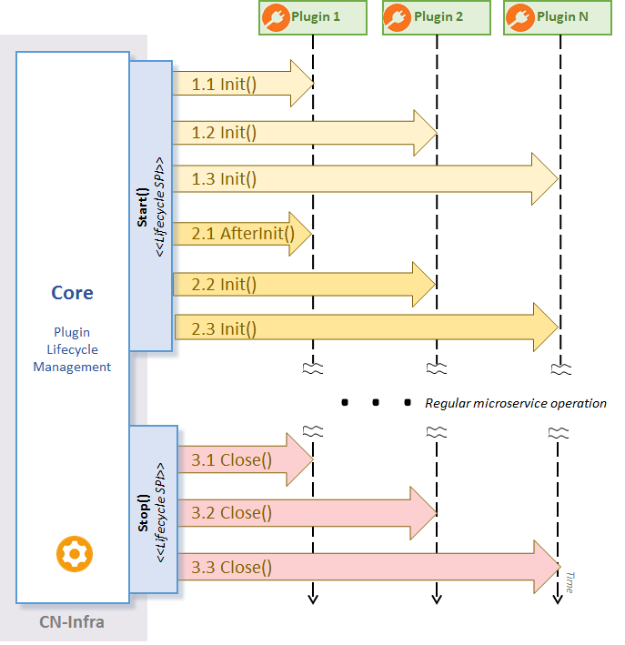

## CN-Infra Core

The `core` package contains the CN-Infra Core that manages the startup
and shutdown of an CN-Infra based applications. Startup & shutdown lifecycle
is is depicted on following sequence diagram. The behaviour of startup & shutdown is 
described in comments [Start(), Stop()](agent_core.go), [EventLoopWithInterrupt()](event_loop.go).

The `core` package also defines the CN-Infra Core's [SPI](plugin_spi.go) that must be 
implemented by each plugin (see [Guidelines](../docs/guidelines/PLUGIN_LIFECYCLE.md)). 
The SPI is used by the Core to Init(), AfterInit() and Close() each plugin. 
 

